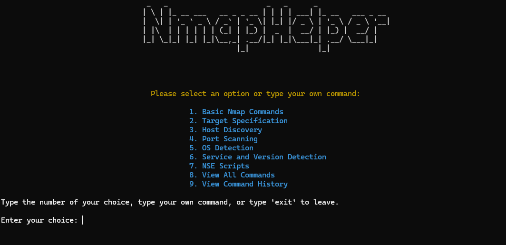
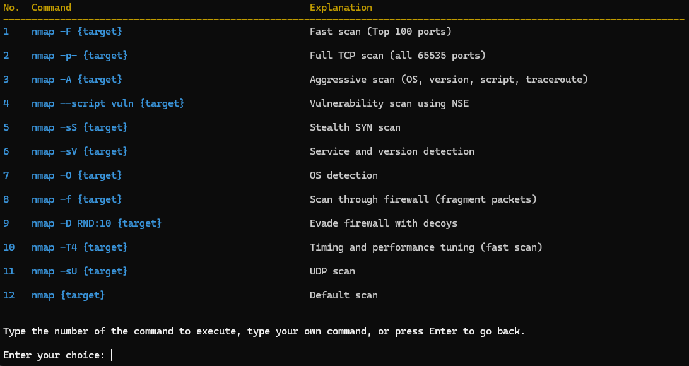
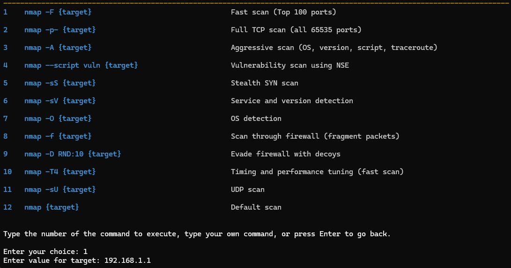

# nmap_helper

                                  _   _                       _   _      _
                                 | \ | |_ __ ___   __ _ _ __ | | | | ___| |_ __   ___ _ __
                                 |  \| | '_ ` _ \ / _` | '_ \| |_| |/ _ \ | '_ \ / _ \ '__|
                                 | |\  | | | | | | (_| | |_) |  _  |  __/ | |_) |  __/ |
                                 |_| \_|_| |_| |_|\__,_| .__/|_| |_|\___|_| .__/ \___|_|
                                                       |_|                |_|


# NmapHelper

**Nmap Helper** is a Python-based CLI tool designed to help new users and cybersecurity professionals easily understand and execute common Nmap commands. It serves as both a practical reference and a learning tool, with an intuitive interface and real-time feedback on command execution.



## Features

- **Predefined Nmap Commands**: Access to a wide variety of commonly used Nmap commands with easy-to-understand explanations.
- **Real-time Command Execution**: Execute Nmap commands directly from the tool and see real-time results.
- **Command History**: View and re-run previously executed commands.
- **Input Sanitization**: Ensures safe execution of user inputs by sanitizing them to avoid command injection.
- **Cross-Platform Compatibility**: Works on Windows, Linux, and macOS.
- **Real-time Output**: See the output of your Nmap commands in real-time, with color-coded output for better readability.

## Requirements

- **Python 3.6+**
- **Nmap**: Make sure Nmap is installed and accessible from the terminal.
- **colorama**: For cross-platform colored terminal output.



## Installation

1. Clone the repository:

    ```bash
    git clone https://github.com/jgpython/nmap_helper.git
    cd nmap_helper
    ```

2. Install the required Python packages:

    ```bash
    pip install colorama
    ```

3. Ensure Nmap is installed on your system. You can check by running:

    ```bash
    nmap -v
    ```

    If Nmap is not installed, follow the instructions on the [Nmap download page](https://nmap.org/download.html).

## Usage

To run the Nmap Cheat Sheet CLI tool, execute the following command:

```bash
python nmap_helper.py
```

## Example
To run a fast scan on a target:

1. Choose option 1 for Basic Nmap Commands.
2. Select the fast scan command (nmap -F {target}).
3. Enter the IP address or domain when prompted.



The output will be displayed in real-time.


## Cybersecurity Implications
Nmap Helper aids in learning how to use Nmap in a cybersecurity context. Here are a few key takeaways:

### Network Scanning
Nmap is a vital tool for identifying open ports, services, and vulnerabilities on target networks. It's widely used in cybersecurity for network exploration and security auditing.

### Security Scanning and NSE
By utilizing Nmap's scripting engine (NSE), this tool also allows users to automate scanning for known vulnerabilities, giving them a broader perspective on network security.

### Best Practices
While using Nmap, remember that unauthorized scanning of networks is illegal. Ensure you have proper permissions before scanning any network.


## License
This project is licensed under the MIT License - see the [LICENSE](LICENSE) file for details.

## Contribution
Feel free to contribute by submitting issues or pull requests. Any improvements to make this tool more user-friendly or feature-rich are appreciated!

## Disclaimer
This tool is for educational purposes only. It should not be used for illegal activities or scanning networks without proper authorization.


## Author
**Created by**: jgpython  
**GitHub**: [https://github.com/jgpython](https://github.com/jgpython)

